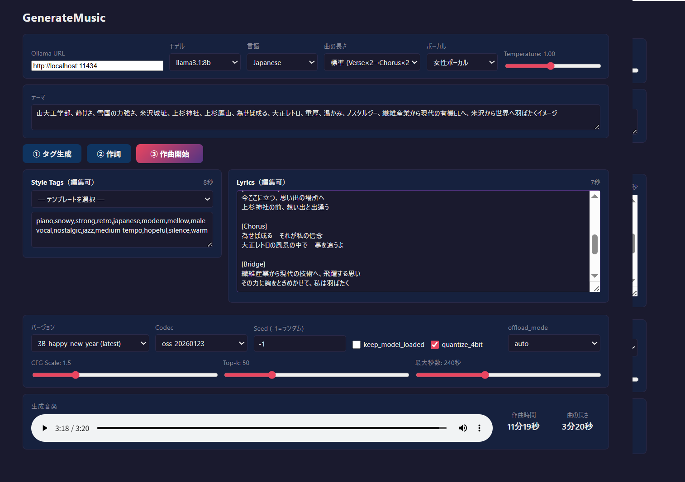

# GenerateMusic

Ollama（ローカルLLM）で歌詞とスタイルタグを生成し、[HeartMuLa](https://github.com/HeartMuLa/heartlib) で楽曲を生成するアプリです。  
**Backend（Python / FastAPI）** と **Frontend（TypeScript / React）** に分離した構成で、Python の依存関係競合を最小化しています。



---

## 機能

- **① タグ生成** : Ollama にテーマ・ボーカル種別・曲の長さを渡し、HeartMuLa 用のスタイルタグを自動生成
- **スタイルテンプレート** : デュエット・女性ボーカル・男性ボーカルを中心に 15 種類のプリセットからワンクリックでタグを設定（インスト 2 種含む）
- **② 作詞** : Ollama にスタイルタグを含むプロンプトを渡し、セクションマーカー付きの歌詞を自動生成
- **③ 作曲開始** : HeartMuLa が歌詞とタグから楽曲を生成し、WAV ファイルとして保存（SSE でリアルタイム進捗表示）
- **インストゥルメンタル対応** : タグに `instrumental` が含まれる場合、歌詞の代わりに `[instrumental]` マーカーを渡してボーカルなしで生成
- **Ollama モデル自動取得** : Ollama URL 入力後にインストール済みモデルをドロップダウンで選択可能（未接続時はテキスト入力にフォールバック）
- タグ・歌詞は画面上で直接編集可能
- 生成後に「タグ生成時間」「作詞時間」「作曲時間」「曲の長さ」を表示
- 4ビット量子化（BitsAndBytesConfig）対応でVRAM節約
- `models/` フォルダに配置したモデルを自動検出してドロップダウンに表示

---

## 動作環境

| 項目 | 内容 |
|---|---|
| OS | Windows 10/11 |
| GPU | NVIDIA RTX 3060 12GB VRAM（CUDA 12.x）以上推奨 |
| Python | 3.11 |
| Node.js | 18 以上 |
| CUDA | 12.8 以上 |
| Ollama | 最新版（`http://localhost:11434` で起動） |

---

## フォルダ構成

```
GenerateMusic/
├── backend/                    # Python / FastAPI
│   ├── main.py                 # FastAPI エントリーポイント（port 8001）
│   ├── requirements.txt        # ML専用依存（gradio 不要）
│   ├── start.bat               # バックエンド起動スクリプト
│   ├── venv/                   # Python 仮想環境
│   ├── routers/
│   │   ├── tags.py             # POST /api/tags
│   │   ├── lyrics.py           # POST /api/lyrics
│   │   └── music.py            # POST /api/music（SSE）/ GET /api/versions
│   └── services/
│       ├── ollama.py           # Ollama API ラッパー
│       ├── pipeline.py         # HeartMuLa パイプライン管理
│       └── prompts.py          # システム/ユーザープロンプト定数
├── frontend/                   # TypeScript / React + Vite（port 5170）
│   ├── src/
│   │   ├── App.tsx             # メイン UI
│   │   ├── App.css             # ダークテーマ CSS
│   │   └── api/client.ts       # バックエンド API クライアント
│   ├── vite.config.ts          # ポート 5170、プロキシ → localhost:8001
│   └── package.json
├── heartlib/                   # HeartMuLa ライブラリ（ローカルコピー）
│   ├── heartcodec/
│   ├── heartmula/
│   └── pipelines/
│       └── music_generation.py
├── models/                     # モデルファイル（.gitignore 対象）
└── output/                     # 生成 WAV ファイル（.gitignore 対象）
```

---

## セットアップ

### 1. リポジトリのクローン

```bash
git clone https://github.com/yisikawa/GenerateMusic.git
cd GenerateMusic
```

### 2. Python 仮想環境の作成

```bash
python -m venv backend\venv
backend\venv\Scripts\activate
```

### 3. PyTorch（CUDA版）のインストール

```bash
pip install torch torchaudio torchvision --index-url https://download.pytorch.org/whl/cu128
```

### 4. バックエンド依存パッケージのインストール

```bash
pip install -r backend\requirements.txt
```

### 5. フロントエンド依存パッケージのインストール

```bash
cd frontend
npm install
cd ..
```

### 6. HeartMuLa モデルの配置

以下の構成で `models/` フォルダにモデルファイルを配置してください。

```
models/
├── HeartMuLa-oss-3B-happy-new-year/   # 推奨（最新）
│   ├── model-00001-of-00004.safetensors
│   ├── model-00002-of-00004.safetensors
│   ├── model-00003-of-00004.safetensors
│   └── model-00004-of-00004.safetensors
├── HeartMuLa-oss-3B/                  # ベースモデル
├── HeartMuLa-RL-oss-3B-20260123/      # RLモデル
├── HeartCodec-oss-20260123/           # Codec（推奨）
├── HeartCodec-oss/                    # Codec（旧）
├── tokenizer.json
└── gen_config.json
```

モデルは [HeartMuLa HuggingFace](https://huggingface.co/HeartMuLa) から入手してください。

### 7. Ollama のセットアップ

[Ollama](https://ollama.com/) をインストールし、使用するモデルを pull してください。

```bash
ollama pull qwen2.5:7b
```

---

## 起動

バックエンドとフロントエンドを **別々のターミナル** で起動します。

### バックエンド（ターミナル 1）

```powershell
backend\start.bat
```

または手動で：

```powershell
backend\venv\Scripts\python.exe -m uvicorn backend.main:app --reload --port 8001
```

API が `http://localhost:8001` で起動します。

### フロントエンド（ターミナル 2）

```powershell
cd frontend
npm run dev
```

ブラウザで `http://localhost:5170` を開きます。

---

## 使い方

1. **Ollama 設定** : URL を入力するとインストール済みモデルが自動取得されてドロップダウンに表示。言語・曲の長さ・ボーカル・Temperature を設定
2. **テーマ** : 曲のテーマや雰囲気を日本語（または選択言語）で入力
3. **① タグ生成** : スタイルタグを AI で自動生成。またはテンプレートから選択（編集可）
4. **② 作詞** : 歌詞を自動生成（編集可）。ボーカルが「インストゥルメンタル」の場合は不要
5. **③ 作曲開始** : HeartMuLa で楽曲を生成（初回はモデルロードに数分かかります）

### インストゥルメンタル生成

ボーカルを「インストゥルメンタル」に設定するか、スタイルタグに `instrumental` を含めると、歌詞の代わりに `[instrumental]` マーカーが HeartMuLa に渡され、ボーカルなしの楽曲が生成されます。

生成された WAV ファイルは `output/` フォルダに保存されます。

---

## HeartMuLa パラメータ

| パラメータ | 説明 | デフォルト |
|---|---|---|
| バージョン | 使用する HeartMuLa モデル | 自動検出 |
| Codec | HeartCodec のバージョン | oss-20260123 |
| Seed | 乱数シード（-1 でランダム） | -1 |
| CFG Scale | Classifier-Free Guidance 強度 | 1.5 |
| Top-k | サンプリング候補数 | 50 |
| 最大秒数 | 生成する音楽の最大長 | 210 秒 |
| keep_model_loaded | 生成後もモデルを VRAM に保持 | OFF |
| quantize_4bit | 4 ビット量子化（VRAM 節約） | ON |
| offload_mode | モデルオフロード方式 | auto |

---

## 注意事項

- `models/` と `output/` は `.gitignore` によりリポジトリに含まれません
- `heartlib/` はローカルコピーです。ComfyUI 版をベースに `comfy.utils` 依存を除去しています
- 初回の作曲時はモデルのロードに 5〜10 分かかります（RTX 3060 + 4bit 量子化の場合）
- GPU VRAM が不足する場合は `quantize_4bit` を ON にしてください
- 作曲は同時に 1 件のみ実行できます（内部で排他ロック制御）
